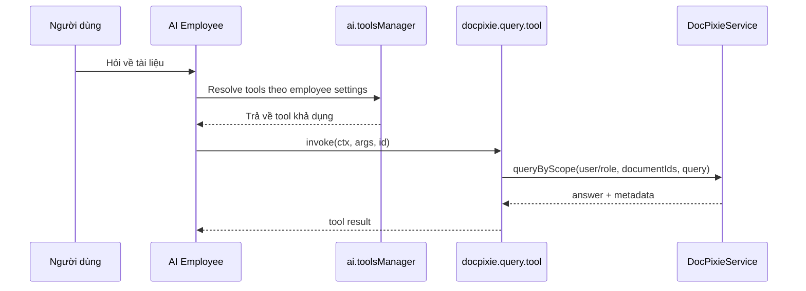

# Đặc tả triển khai: tích hợp DocPixie làm AI Tool cho AI Employee

## 1) Mục tiêu và phạm vi
Tài liệu này chuẩn hóa phương án tích hợp `plugin-docpixie` vào hệ sinh thái AI Employee theo codebase hiện tại.

**Mục tiêu bắt buộc**
- Không sửa mã nguồn của `plugin-ai`.
- Toàn bộ logic đăng ký Tool nằm trong `plugin-docpixie`.
- Tool chỉ cho phép truy cập tài liệu mà user hiện tại có quyền (user/role scope).

**Ngoài phạm vi**
- Không thay đổi UI riêng cho DocPixie ở client.
- Không thêm API công khai mới trong `plugin-ai`.

## 2) Thực trạng API ở nhánh hiện tại (quan trọng)
Để triển khai đúng, cần bám runtime hiện tại của `plugin-ai`:

- Điểm đăng ký tool đang dùng: `this.ai.toolsManager.registerTools(...)`.
- Contract tool phải là `ToolsOptions` (`scope`, `definition`, `invoke`, ...).
- Không dùng payload kiểu `{ name, tool }`.
- Không dùng `aiManager.toolsManager` (plural). Đây là giả định sai với code hiện tại.

## 3) Kiến trúc tích hợp đề xuất



## 4) Thiết kế kỹ thuật chi tiết

### Bước 1: phụ thuộc plugin
Trong `plugin-docpixie/package.json`, giữ `@nocobase/plugin-ai` ở `peerDependencies` để đảm bảo thứ tự load phù hợp.

### Bước 2: định nghĩa tool theo `ToolsOptions`
Tạo module tool server-side (ví dụ: `src/server/tools/docpixie-query-tool.ts`) trả về đúng kiểu `ToolsOptions`.

Ví dụ contract:

```ts
import type { ToolsOptions } from '@nocobase/ai';

export const createDocPixieQueryTool = (service): ToolsOptions => ({
  scope: 'CUSTOM',
  execution: 'backend',
  defaultPermission: 'ASK',
  introduction: {
    title: 'DocPixie Document Expert',
    about: 'Phân tích tài liệu bằng adaptive RAG + vision trong phạm vi quyền truy cập hiện tại.',
  },
  definition: {
    name: 'docpixie.query.document',
    description: 'Trả lời câu hỏi dựa trên tài liệu DocPixie mà user hiện tại được phép xem.',
    schema: {
      type: 'object',
      properties: {
        query: { type: 'string' },
        documentIds: { type: 'array', items: { type: 'number' } },
        strategy: { type: 'string', enum: ['hybrid', 'vision_first', 'text_first'] },
      },
      required: ['query'],
    },
  },
  invoke: async (ctx, args) => {
    const userId = ctx.state?.currentUser?.id;
    const roleNames = ctx.state?.currentUser?.roles?.map((r) => r.name) ?? [];
    return service.queryByScope({
      userId,
      roleNames,
      query: args.query,
      documentIds: args.documentIds,
      strategy: args.strategy,
    });
  },
});
```

### Bước 3: đăng ký tool trong `plugin-docpixie`
Trong `src/server/plugin.ts`, sau khi service được khởi tạo:

- Lấy AI plugin bằng `this.app.pm.get('ai')`.
- Nếu tồn tại, gọi `aiPlugin.ai.toolsManager.registerTools(createDocPixieQueryTool(this.service))`.
- Đăng ký theo hướng idempotent (không đăng ký trùng khi reload).
- Nếu không có `plugin-ai`, chỉ log warning và vẫn giữ DocPixie REST hoạt động bình thường.

## 5) Ràng buộc bảo mật dữ liệu (bắt buộc)
Hiện tại truy vấn nội bộ của DocPixie mới lọc theo `status: 'ready'` (+ `documentIds` nếu có), chưa ràng buộc user/role.

**Yêu cầu triển khai**
- Bổ sung truy vấn theo quyền trong đường đi của AI Tool (không dùng truy vấn global mặc định).
- Gợi ý cập nhật service:
  - Tạo method `queryByScope({ userId, roleNames, query, documentIds, strategy })`.
  - Trong load documents, chỉ lấy tài liệu mà user hiện tại có quyền đọc (ownership, sharing policy, role binding).
- Nếu `documentIds` chứa tài liệu ngoài quyền, bỏ qua tài liệu đó và trả metadata cảnh báo nhẹ, không lộ dữ liệu.

## 6) Hành vi trong AI Employee UI
- Tool `scope: CUSTOM` sẽ xuất hiện trong danh sách kỹ năng để admin bind theo từng AI Employee.
- Admin có thể bật/tắt tool cho từng employee mà không cần client code mới từ DocPixie.

## 7) Acceptance criteria
Một bản implement được xem là đạt khi thỏa toàn bộ tiêu chí sau:

1. `plugin-docpixie` bật cùng `plugin-ai` thì tool `docpixie.query.document` xuất hiện trong `aiTools:list`.
2. Tool có thể bind vào employee và gọi thành công qua hội thoại AI.
3. Tool chỉ trả dữ liệu từ tài liệu user/role hiện tại được phép truy cập.
4. Không có thay đổi mã nguồn trong `packages/plugins/@nocobase/plugin-ai`.
5. Nếu `plugin-ai` vắng mặt, DocPixie không crash và API `docpixie:*` vẫn hoạt động.

## 8) Handoff triển khai (file đích)
- `packages/plugins/@nocobase/plugin-docpixie/src/server/tools/docpixie-query-tool.ts`
- `packages/plugins/@nocobase/plugin-docpixie/src/server/plugin.ts`
- `packages/plugins/@nocobase/plugin-docpixie/src/server/services/DocPixieService.ts`

Khuyến nghị thêm test server theo pattern plugin test hiện có để bao phủ:
- đăng ký tool,
- bind tool theo employee,
- và kiểm soát truy cập dữ liệu theo user/role.
